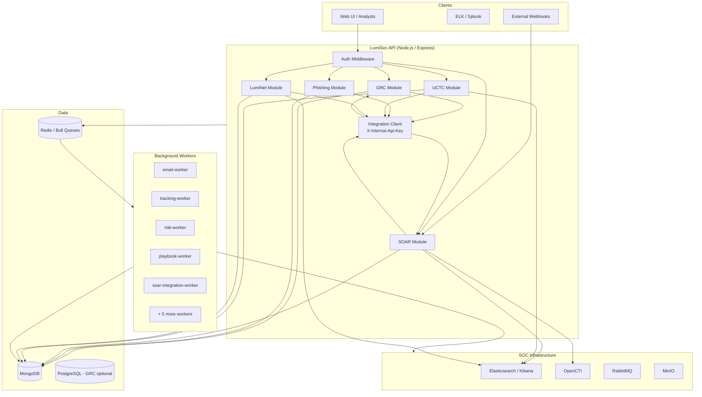

# LumiSec Platform Overview

LumiSec is a unified cybersecurity operations platform delivered as a **single Node.js / Express / MongoDB monolith**. All five security tools—GRC, Phishing Simulation, SOAR, UCTC (Unified Cyber Threat & Compliance), and LumiNet Network Discovery—are implemented as modules under `src/modules/` and share authentication, database connections, queue infrastructure, and integration middleware.

There are **no separate ASP.NET SOAR or TypeScript GRC repositories**. One API process (`index.js`) mounts every module; background workers consume Bull queues prefixed with `lumisec.*`.

---

## Platform Modules

| Module | Mount Path(s) | Purpose |
|--------|---------------|---------|
| **Auth** | `/api/auth` | JWT signup, login, profile |
| **GRC** | `/api/grc` | Governance, risk, compliance, findings, evidence, audit reports |
| **Phishing** | `/api/phishing` | Campaign simulation, templates, tracking, risk scoring |
| **SOAR** | `/api/soar` | Incident response, playbooks, artifacts, webhooks, connectors |
| **UCTC** | `/api/uctc`, `/api/v1` (alias) | Sigma rule builder, sandbox lab, tuning, SIEM deploy |
| **LumiNet (Network)** | `/api/luminet`, `/api/v1` (alias) | Discovery, port scan, asset inventory, sniffing, misconfigurations |

Health checks: `GET /health` and `GET /api/health`.

OpenAPI specs are served at `/api/grc/docs/openapi.json` and `/api/soar/docs/openapi.json`.

---

## High-Level Architecture



---

## Request Lifecycle

1. **Authentication** — User requests carry `Authorization: Bearer <JWT>`. Service-to-service integration routes also accept `X-Internal-Api-Key: ***` (see `src/middleware/serviceAuth.js`).
2. **Authorization** — Role-based permissions per module (`permissions.js` in each module).
3. **Validation** — Joi schemas in `*.validation.js` files via `isValid` middleware.
4. **Handler** — Controller delegates to service layer; audit logs and notifications are emitted where applicable.
5. **Integration** — Cross-module calls use either **in-process imports** (`INTEGRATION_MODE=inprocess`, default) or **HTTP loopback** (`INTEGRATION_MODE=http`) through `src/utils/integrationClient.js`.

---

## Data Stores

| Store | Usage |
|-------|-------|
| **MongoDB** | Primary document store for all modules (45 Mongoose models) |
| **Redis** | Bull job queues (`lumisec.phishing.email`, `lumisec.soar.legacy`, etc.) |
| **PostgreSQL** | Optional GRC relational store (configured via `PG_*` env vars) |
| **Local filesystem** | Evidence uploads (`uploads/evidence`), reports (`uploads/reports`), SOAR analytics exports |

MongoDB transactions are enabled when `MONGO_TRANSACTIONS=true` or `NODE_ENV=production` (see `src/utils/transaction.js`).

---

## Background Workers

| Worker | Queue | Role |
|--------|-------|------|
| `emailWorker` | `lumisec.phishing.email` | Sends phishing campaign emails |
| `trackingWorker` | `lumisec.phishing.tracking` | Processes open/click/submit events |
| `riskWorker` | `lumisec.phishing.risk` | Calculates recipient risk scores |
| `reportWorker` | `lumisec.report` | Generates PDF campaign / audit reports |
| `playbookWorker` | `lumisec.soar.legacy` | Executes SOAR playbook actions |
| `enrichmentWorker` | `lumisec.soar.enrichment` | Artifact enrichment (OpenCTI, etc.) |
| `alertWorker` | `lumisec.soar.alert` | Processes inbound alert webhooks |
| `notificationWorker` | `lumisec.soar.notification` | SOAR analyst notifications |
| `analyticsWorker` | `lumisec.soar.analytics` | KPI snapshots and exports |
| `integrationWorker` | `lumisec.soar.integration` | Async firewall/EDR/SIEM actions |

All workers are defined in `docker-compose.yml` as separate containers built from the same `Dockerfile`.

---

## User Roles

Defined in `src/utils/constant/enums.js`:

- `admin`, `soc_analyst`, `soc_manager`, `red_team`, `detection_engineer`
- `auditor`, `compliance_manager`, `grc_manager`
- `it_manager`, `phishing_operator`, `phishing_manager`
- `senior_analyst`, `integration_admin`, `read_only`, `assignee`

The synthetic **Integration Service** account (`integration@lumisec.internal`, role `integration_admin`) is injected when a valid internal API key is presented.

---

## API Surface Summary

| Module | Routes | Automated Tests |
|--------|--------|-----------------|
| GRC | 57 | 8 test cases |
| Phishing | 41 | 7 test cases |
| SOAR | 78 | 13 test cases |
| UCTC | 26 | 7 test cases |
| Network (LumiNet) | 14 | (covered in UCTC/integration tests) |
| Auth | 3 | 4 test cases |
| Integrations | — | 6 test cases |
| Health | 2 | 1 test case |

Run the full suite: `npm test`.

---

## Repository Layout

```
LumiSec-Backendzz/
├── index.js                 # HTTP server entry (Express + Socket.IO)
├── src/
│   ├── app.js               # createApp factory
│   ├── bootstrap.js         # Route mounting
│   ├── modules/             # grc, phishing, soar, uctc, network, auth
│   ├── middleware/          # auth, validation, rateLimit, serviceAuth
│   ├── integrations/        # elk, opencti, firewall, ssh, winrm, mailer
│   ├── workers/             # Bull queue consumers
│   └── utils/               # queue, transaction, integrationClient, helpers
├── database/
│   ├── models/              # Mongoose schemas
│   └── seeds/               # frameworks, soar seed scripts
├── config/.env              # Runtime secrets (not committed)
├── docker-compose.yml       # App + Mongo + Redis + 10 workers
├── Dockerfile
├── test/                    # node:test + supertest API tests
└── lumisec-docs/            # This documentation set
```

---

## Getting Started

```bash
# Install dependencies
npm install

# Configure environment (copy and edit)
cp config/.env.example config/.env

# Seed compliance frameworks (optional)
npm run seed:frameworks

# Start API
npm run dev

# Run tests
npm test

# Docker stack (API + Mongo + Redis + workers)
docker compose up --build
```

---

## Related Documents

| Doc | Contents |
|-----|----------|
| [01-grc-platform.md](./01-grc-platform.md) | GRC routes, models, compliance |
| [02-phishing-simulation.md](./02-phishing-simulation.md) | Campaigns, tracking, rate limits |
| [03-soar-platform.md](./03-soar-platform.md) | Incidents, playbooks, webhooks |
| [04-network-uctc-platform.md](./04-network-uctc-platform.md) | LumiNet + UCTC detection engineering |
| [05-soc-infrastructure.md](./05-soc-infrastructure.md) | pfSense, DMZ, SOC-CORE topology |
| [06-integrations-map.md](./06-integrations-map.md) | Cross-module integration flows |
| [07-tech-stack.md](./07-tech-stack.md) | Dependencies and tooling |
| [08-Infrastructure.md](./08-Infrastructure.md) | Docker, env vars, deployment |
| [09-technical-changelog.md](./09-technical-changelog.md) | Recent integration and infra changes |
