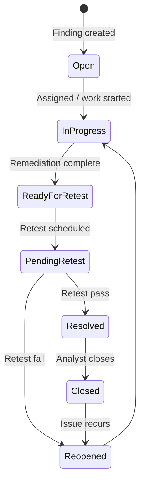

# GRC Platform Module

The Governance, Risk, and Compliance (GRC) module lives at **`/api/grc`** and provides the central findings registry, risk register, remediation workflow, evidence management, audit reporting, and compliance control mapping for the entire LumiSec platform.

Implementation: `src/modules/grc/` (router, controller, validation, permissions, services).

---

## Capabilities

- **Findings lifecycle** — Create, assign, close, reopen, delete, history, retest
- **Risk register** — Likelihood/impact scoring, accept/mitigate/close treatments
- **Remediation tasks** — Linked to findings; complete/verify workflow
- **Evidence uploads** — Multer-based file storage under `uploads/evidence`
- **Audit reports** — PDF generation via `reportWorker` and `pdfkit`
- **Compliance controls** — ISO 27001, NIST, PCI-DSS, SOC 2 framework mapping
- **Dashboards** — Overview, risks, compliance status, tasks, risk heatmap
- **Audit logs** — Immutable entity-level change history
- **Notifications** — In-app alerts for assignments and integrations
- **Inbound integrations** — Network, UCTC, SOAR, Phishing, SIEM, OpenCTI

---

## Route Map (57 endpoints)

### Findings (11)

| Method | Path | Description |
|--------|------|-------------|
| POST | `/findings` | Create finding |
| GET | `/findings` | List with filters/pagination |
| GET | `/findings/:id` | Get by ID |
| PATCH | `/findings/:id` | Update |
| PATCH | `/findings/:id/assign` | Assign analyst |
| PATCH | `/findings/:id/close` | Close |
| PATCH | `/findings/:id/reopen` | Reopen |
| DELETE | `/findings/:id` | Soft delete |
| GET | `/findings/:id/history` | Audit trail |
| POST | `/findings/:id/retest` | Schedule retest |
| GET | `/findings/:id/retests` | List retests |

### Risks (7)

| Method | Path | Description |
|--------|------|-------------|
| POST | `/risks` | Create risk |
| GET | `/risks` | List |
| GET | `/risks/:id` | Get |
| PATCH | `/risks/:id` | Update |
| PATCH | `/risks/:id/accept` | Accept risk |
| PATCH | `/risks/:id/mitigate` | Mark mitigated |
| PATCH | `/risks/:id/close` | Close |

### Remediation Tasks (6)

| Method | Path | Description |
|--------|------|-------------|
| POST | `/tasks` | Create task |
| GET | `/tasks` | List |
| GET | `/tasks/:id` | Get |
| PATCH | `/tasks/:id` | Update |
| PATCH | `/tasks/:id/complete` | Mark complete |
| PATCH | `/tasks/:id/verify` | Verify remediation |

### Evidence (3)

| Method | Path | Description |
|--------|------|-------------|
| POST | `/evidence` | Upload file (multipart) |
| GET | `/evidence/:id` | Download metadata |
| DELETE | `/evidence/:id` | Delete |

### Audit Reports (8)

| Method | Path | Description |
|--------|------|-------------|
| POST | `/reports` | Create report shell |
| GET | `/reports` | List |
| GET | `/reports/:id` | Get |
| PATCH | `/reports/:id` | Update |
| DELETE | `/reports/:id` | Delete |
| POST | `/reports/:id/findings` | Attach findings |
| POST | `/reports/:id/generate` | Queue PDF generation |
| GET | `/reports/:id/download` | Download PDF |

### Compliance (6)

| Method | Path | Description |
|--------|------|-------------|
| POST | `/compliance/controls` | Create control |
| GET | `/compliance/controls` | List controls |
| GET | `/compliance/controls/:id` | Get control |
| PATCH | `/compliance/controls/:id` | Update |
| POST | `/compliance/controls/:id/link-finding` | Map finding to control |
| GET | `/compliance/status` | Framework compliance summary |

### Dashboard (5)

| Method | Path |
|--------|------|
| GET | `/dashboard/overview` |
| GET | `/dashboard/risks` |
| GET | `/dashboard/compliance` |
| GET | `/dashboard/tasks` |
| GET | `/dashboard/risk-heatmap` |

### Audit Logs (2)

| Method | Path |
|--------|------|
| GET | `/audit-logs` |
| GET | `/audit-logs/:entityType/:entityId` |

### Notifications (2)

| Method | Path |
|--------|------|
| GET | `/notifications` |
| PATCH | `/notifications/:id/read` |

### Integrations (7)

All integration routes accept **JWT** or **`X-Internal-Api-Key: ***`**.

| Method | Path | Source Module |
|--------|------|---------------|
| POST | `/integrations/network/findings` | LumiNet |
| POST | `/integrations/uctc/findings` | UCTC |
| POST | `/integrations/soar/incidents` | SOAR |
| PATCH | `/integrations/soar/tasks/:id` | SOAR |
| POST | `/integrations/phishing/risk` | Phishing |
| POST | `/integrations/siem/alerts` | ELK/SIEM |
| POST | `/integrations/opencti/ioc` | OpenCTI |

---

## Data Models (14 GRC-specific)

| Model | File | Purpose |
|-------|------|---------|
| `Finding` | `finding.model.js` | Central finding record with `sourceModule` + `sourceId` |
| `Risk` | `risk.model.js` | Risk register entries linked to findings |
| `RemediationTask` | `remediationTask.model.js` | Task workflow |
| `Evidence` | `evidence.model.js` | Uploaded proof artifacts |
| `AuditReport` | `auditReport.model.js` | Report shells and generated PDFs |
| `ComplianceControl` | `complianceControl.model.js` | Control assessments |
| `Retest` | `retest.model.js` | Finding retest results |
| `SiemAlert` | `siemAlert.model.js` | Ingested SIEM alert metadata |
| `AuditLog` | `auditLog.model.js` | Change audit trail |
| `Notification` | `notification.model.js` | User notifications |
| `Framework` | `framework.model.js` | Compliance framework metadata |
| `FrameworkRequirement` | `frameworkRequirement.model.js` | Requirement hierarchy |
| `UnifiedControl` | `unifiedControl.model.js` | Normalized control catalog |
| `RequirementControlMapping` | `requirementControlMapping.model.js` | Requirement ↔ control links |

---

## Idempotency

Findings created via integration endpoints are **idempotent** on `(sourceModule, sourceId)`. If a duplicate ingest arrives, the existing finding is returned instead of creating a second record.

```javascript
// src/modules/grc/services/finding.service.js
if (data.sourceModule && data.sourceId) {
    const existing = await Finding.findOne({ sourceModule, sourceId });
    if (existing) return existing;
}
```

Integration tests verify this behavior for network findings (`test/integrations.api.test.js`).

---

## Framework Importer

Compliance frameworks are imported from JSON files in `grc_frameworks/` via:

```bash
npm run seed:frameworks
# Dry run (no writes):
node database/seeds/frameworks.seed.js --dry-run
```

The importer (`src/modules/grc/services/frameworkImporter.service.js`):

1. Scans framework JSON files
2. Parses requirement records and control text patterns `[CODE]: description`
3. Upserts `Framework`, `FrameworkRequirement`, `UnifiedControl`, and `RequirementControlMapping` documents
4. Prints an import summary (files scanned, imported/skipped counts)

Supported framework identifiers include **ISO27001**, **NIST**, **PCI_DSS**, and **SOC2** (see `complianceFramework` enum).

---

## GRC Workflow Diagram



---

## Permissions

Role permissions are defined in `src/modules/grc/permissions.js`. Key roles:

- **`grc_manager`** — Full GRC CRUD
- **`compliance_manager`** — Controls and compliance status
- **`auditor`** — Read-only reports and audit logs
- **`assignee`** — Task completion on assigned items
- **`integration_admin`** — All integration ingest routes

---

## PostgreSQL (Optional)

The `.env.example` includes PostgreSQL connection variables (`PG_HOST`, `PG_PORT`, `PG_USER`, `PG_PASSWORD`, `PG_DATABASE`). MongoDB remains the primary store; PostgreSQL support is reserved for future relational GRC reporting or external tool sync.

---

## OpenAPI

Machine-readable spec: `GET /api/grc/docs/openapi.json` (served from `docs/grc-openapi.json`).

---

## Testing

`test/grc.api.test.js` — 8 test cases covering findings, risks, tasks, and auth guards.

`test/integrations.api.test.js` — SIEM alert ingest, network finding idempotency, internal API key auth.
