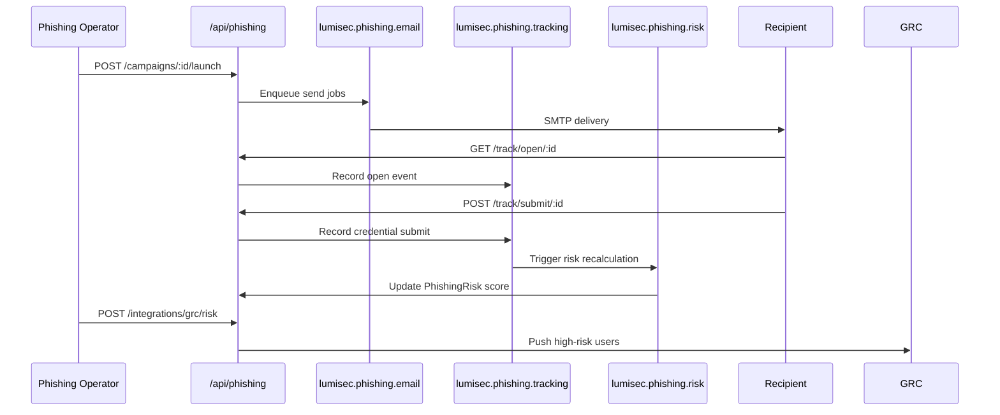

# Phishing Simulation Module

The Phishing Simulation module at **`/api/phishing`** enables security teams to run controlled phishing campaigns, track recipient behavior, score human-risk, and push outcomes into GRC, SOAR, SIEM, and OpenCTI.

Implementation: `src/modules/phishing/`.

---

## Capabilities

- **Email templates** — HTML/text templates with merge fields
- **Landing pages** — Credential capture pages (educational mode)
- **Recipient management** — CSV import, department tagging
- **Campaign lifecycle** — Draft → launch → pause/resume/stop
- **Public tracking endpoints** — Open, click, visit, submit, download (rate-limited)
- **Risk scoring** — Background `riskWorker` calculates per-recipient risk
- **Reporting** — PDF campaign reports via `reportWorker`
- **Dashboards** — Overview, department breakdown, trend charts
- **Outbound integrations** — GRC risk, SOAR incidents, SIEM events, OpenCTI indicators

---

## Route Map (41 endpoints)

### Templates (5)

| Method | Path |
|--------|------|
| POST | `/templates` |
| GET | `/templates` |
| GET | `/templates/:id` |
| PATCH | `/templates/:id` |
| DELETE | `/templates/:id` |

### Landing Pages (5)

| Method | Path |
|--------|------|
| POST | `/landing-pages` |
| GET | `/landing-pages` |
| GET | `/landing-pages/:id` |
| PATCH | `/landing-pages/:id` |
| DELETE | `/landing-pages/:id` |

### Recipients (5)

| Method | Path |
|--------|------|
| POST | `/recipients/import` |
| GET | `/recipients` |
| GET | `/recipients/:id` |
| PATCH | `/recipients/:id` |
| DELETE | `/recipients/:id` |

### Campaigns (9)

| Method | Path | Description |
|--------|------|-------------|
| POST | `/campaigns` | Create campaign |
| GET | `/campaigns` | List |
| GET | `/campaigns/:id` | Get |
| PATCH | `/campaigns/:id` | Update |
| DELETE | `/campaigns/:id` | Delete |
| POST | `/campaigns/:id/recipients` | Attach recipients |
| POST | `/campaigns/:id/launch` | Queue emails |
| POST | `/campaigns/:id/pause` | Pause sending |
| POST | `/campaigns/:id/resume` | Resume |
| POST | `/campaigns/:id/stop` | Cancel |

### Tracking — Public, Rate-Limited (5)

These routes do **not** require JWT. They use an in-memory rate limiter:

```javascript
const trackingRateLimit = rateLimit({ windowMs: 60_000, max: 120 });
```

| Method | Path | Event |
|--------|------|-------|
| GET | `/track/open/:trackingId` | Email opened (pixel) |
| GET | `/track/click/:trackingId` | Link clicked |
| POST | `/track/visit/:trackingId` | Landing page visited |
| POST | `/track/submit/:trackingId` | Credentials submitted |
| POST | `/track/download/:trackingId` | Attachment downloaded |

Rate limit response headers: `X-RateLimit-Limit`, `X-RateLimit-Remaining`. Excess requests return **429**.

### Reports (3)

| Method | Path |
|--------|------|
| POST | `/reports/:campaignId/generate` |
| GET | `/reports/:campaignId/download` |
| GET | `/reports/:campaignId/stats` |

### Dashboard (4)

| Method | Path |
|--------|------|
| GET | `/dashboard/overview` |
| GET | `/dashboard/risks` |
| GET | `/dashboard/departments` |
| GET | `/dashboard/trends` |

### Integrations (4)

Accept JWT or `X-Internal-Api-Key: ***`.

| Method | Path | Target |
|--------|------|--------|
| POST | `/integrations/grc/risk` | GRC risk register |
| POST | `/integrations/soar/incident` | SOAR incident |
| POST | `/integrations/siem/event` | Elasticsearch index |
| POST | `/integrations/opencti/indicator` | OpenCTI IOC |

---

## Data Models

| Model | Purpose |
|-------|---------|
| `Campaign` | Campaign metadata and status |
| `Recipient` | Target users with department/tags |
| `EmailTemplate` | Email content |
| `LandingPage` | Capture page HTML |
| `PhishingEvent` | Tracking events (open, click, submit, etc.) |
| `Attachment` | Malware-simulation attachments |
| `CredentialCapture` | Submitted form data (hashed/redacted) |
| `CampaignReport` | Generated report metadata |
| `PhishingRisk` | Computed risk scores per recipient |

---

## Campaign Flow



---

## Background Workers

| Worker | Queue | Function |
|--------|-------|----------|
| `emailWorker` | `lumisec.phishing.email` | Sends campaign emails via `nodemailer` |
| `trackingWorker` | `lumisec.phishing.tracking` | Persists tracking events asynchronously |
| `riskWorker` | `lumisec.phishing.risk` | Computes penalty-based risk scores |
| `reportWorker` | `lumisec.report` | Generates PDF reports |

SMTP configuration (masked):

```
SMTP_HOST=***
SMTP_PORT=587
SMTP_USER=***
SMTP_PASS=***
SMTP_FROM=LumiSec <noreply@yourdomain.com>
```

---

## Permissions

Defined in `src/modules/phishing/permissions.js`:

- **`phishing_manager`** — Full campaign and template management
- **`phishing_operator`** — Launch campaigns, view results
- **`integration_admin`** — Integration routes

---

## SIEM Integration

Phishing events can be indexed into Elasticsearch via `src/integrations/phishingSiem.js` and the `/integrations/siem/event` route, producing documents compatible with the SOC ELK stack (Winlogbeat-style indices on CLIENT01).

---

## Testing

`test/phishing.api.test.js` — **7 test cases** covering templates, campaigns, tracking, and auth.

Run: `npm test` (includes phishing suite).
