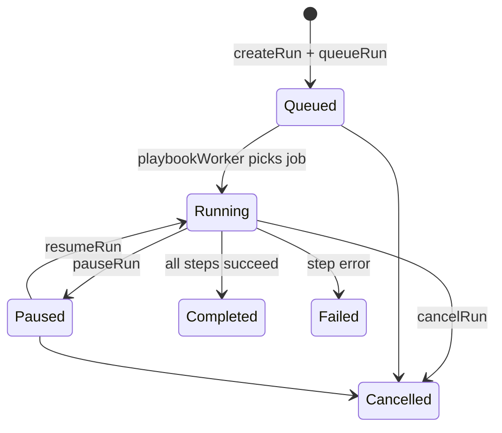

# SOAR Platform Module

Security Orchestration, Automation, and Response (SOAR) is implemented as a **Node.js module** at **`/api/soar`**—not a separate ASP.NET service. It provides incident management, playbook automation, artifact enrichment, webhook ingestion, connector management, credential vault, analytics, and cross-platform integrations.

Implementation: `src/modules/soar/` including `engine/playbookEngine.js` and 11 service files.

---

## Capabilities

- **Incident lifecycle** — Create, update, close, timeline, notes, related incidents
- **Playbook engine** — Queued execution with pause/resume/cancel
- **Artifact management** — IP, domain, hash, email enrichment via OpenCTI
- **Webhook ingestion** — CrowdStrike, Fortigate, Wazuh, Defender, Splunk, custom
- **Connectors** — Firewall, SIEM, EDR, SSH, email, ticketing
- **Credential vault** — AES-encrypted secret storage
- **Dashboards & analytics** — KPIs, snapshots, PDF/CSV export
- **Real-time alerts** — Socket.IO events to analyst rooms
- **Outbound integrations** — GRC, UCTC, Phishing, firewall block, host isolation, SIEM

---

## Route Map (78 endpoints)

### Incidents (15)

| Method | Path                                          |
| ------ | --------------------------------------------- |
| POST   | `/incidents`                                  |
| GET    | `/incidents`                                  |
| GET    | `/incidents/:id`                              |
| PATCH  | `/incidents/:id`                              |
| DELETE | `/incidents/:id`                              |
| PATCH  | `/incidents/:id/close`                        |
| GET    | `/incidents/:id/timeline`                     |
| GET    | `/incidents/:id/artifacts`                    |
| POST   | `/incidents/:id/artifacts`                    |
| GET    | `/incidents/:id/notes`                        |
| POST   | `/incidents/:id/notes`                        |
| GET    | `/incidents/:id/related`                      |
| POST   | `/incidents/:id/related`                      |
| POST   | `/incidents/:id/playbooks/run`                |
| POST   | `/incidents/:incidentId/playbook/:playbookId` |

### Playbooks (10)

| Method | Path                           |
| ------ | ------------------------------ |
| POST   | `/playbooks`                   |
| GET    | `/playbooks`                   |
| GET    | `/playbooks/:id`               |
| PATCH  | `/playbooks/:id`               |
| DELETE | `/playbooks/:id`               |
| GET    | `/playbook-runs`               |
| GET    | `/playbook-runs/:runId`        |
| POST   | `/playbook-runs/:runId/pause`  |
| POST   | `/playbook-runs/:runId/resume` |
| POST   | `/playbook-runs/:runId/cancel` |

### Artifacts (6)

| Method | Path                     |
| ------ | ------------------------ |
| GET    | `/artifacts`             |
| GET    | `/artifacts/:id`         |
| PATCH  | `/artifacts/:id`         |
| DELETE | `/artifacts/:id`         |
| POST   | `/artifacts/:id/enrich`  |
| POST   | `/artifacts/enrich/bulk` |

### Webhooks & Alerts (8)

| Method | Path                    | Source               |
| ------ | ----------------------- | -------------------- |
| POST   | `/webhooks/crowdstrike` | CrowdStrike EDR      |
| POST   | `/webhooks/fortigate`   | Fortigate firewall   |
| POST   | `/webhooks/wazuh`       | Wazuh SIEM           |
| POST   | `/webhooks/defender`    | Microsoft Defender   |
| POST   | `/webhooks/splunk`      | Splunk               |
| POST   | `/webhooks/custom`      | Generic JSON         |
| GET    | `/alerts`               | List ingested alerts |
| GET    | `/alerts/:id`           | Alert detail         |

### Connectors (6)

| Method | Path                      |
| ------ | ------------------------- |
| POST   | `/connectors`             |
| GET    | `/connectors`             |
| GET    | `/connectors/:id`         |
| PATCH  | `/connectors/:id`         |
| DELETE | `/connectors/:id`         |
| POST   | `/connectors/:id/test`    |
| GET    | `/connectors/:id/actions` |

### Vault (5)

| Method | Path         |
| ------ | ------------ |
| POST   | `/vault`     |
| GET    | `/vault`     |
| GET    | `/vault/:id` |
| PATCH  | `/vault/:id` |
| DELETE | `/vault/:id` |

### Dashboard (6)

| Method | Path                    |
| ------ | ----------------------- |
| GET    | `/dashboard/overview`   |
| GET    | `/dashboard/incidents`  |
| GET    | `/dashboard/playbooks`  |
| GET    | `/dashboard/automation` |
| GET    | `/dashboard/connectors` |
| GET    | `/dashboard/analysts`   |

### Analytics (4)

| Method | Path                   |
| ------ | ---------------------- |
| GET    | `/analytics/kpis`      |
| GET    | `/analytics/report`    |
| POST   | `/analytics/export`    |
| GET    | `/analytics/snapshots` |

### Notifications (4)

| Method | Path                          |
| ------ | ----------------------------- |
| GET    | `/notifications`              |
| PATCH  | `/notifications/:id/read`     |
| PATCH  | `/notifications/read-all`     |
| GET    | `/notifications/unread-count` |

### Integrations (11)

Accept JWT or `X-Internal-Api-Key: ***`.

| Method | Path                                 | Action                     |
| ------ | ------------------------------------ | -------------------------- |
| POST   | `/integrations/grc/finding`          | Push finding to GRC        |
| POST   | `/integrations/grc/risk`             | Push risk to GRC           |
| POST   | `/integrations/uctc/rule`            | Trigger UCTC rule workflow |
| POST   | `/integrations/uctc/rule-trigger`    | Alias for rule trigger     |
| POST   | `/integrations/phishing/campaign`    | Link phishing campaign     |
| POST   | `/integrations/firewall/block-ip`    | Block IP on Fortigate      |
| POST   | `/integrations/network/block-ip`     | Alias (network path)       |
| POST   | `/integrations/edr/isolate-host`     | Isolate via SSH/WinRM      |
| POST   | `/integrations/network/isolate-host` | Alias (network path)       |
| POST   | `/integrations/siem/event`           | Index ELK document         |

---

## Playbook Engine

Located at `src/modules/soar/engine/playbookEngine.js` and executed by `src/workers/playbookWorker.js`.

### Supported Action Types

| Action         | Integration                        | Description                |
| -------------- | ---------------------------------- | -------------------------- |
| `block_ip`     | `integrations/firewall.js`         | Fortigate API block        |
| `enrich`       | `integrations/opencti.js`          | IP enrichment              |
| `isolate_host` | `integrations/ssh.js` / `winrm.js` | Linux SSH or Windows WinRM |
| `notify`       | `integrations/mailer.js`           | Email analyst              |
| `ssh_command`  | `integrations/ssh.js`              | Run remote command         |

### Run Lifecycle



### Engine Functions

- `createRun()` — Creates `PlaybookRun` + `PlaybookRunStep` records
- `queueRun()` — Adds job to `lumisec.soar.legacy` Bull queue
- `pauseRun()` / `resumeRun()` / `cancelRun()` — Run control
- `evaluateCondition()` — JavaScript condition evaluation against run context
- `getNextActions()` — Branching on success/failure paths

The controller exports **74 handler functions** (`soar.controller.js`); combined with playbook action handlers in the worker, the platform delivers the full **~75 handler** automation surface.

---

## Data Models

| Model                | Purpose                                  |
| -------------------- | ---------------------------------------- |
| `Incident`           | Core incident record                     |
| `IncidentNote`       | Analyst notes                            |
| `Artifact`           | Observables (IP, hash, domain, etc.)     |
| `ArtifactEnrichment` | Enrichment results                       |
| `Playbook`           | Playbook definition with ordered actions |
| `PlaybookRun`        | Execution instance                       |
| `PlaybookRunStep`    | Per-step status and results              |
| `Connector`          | External system connectors               |
| `CredentialVault`    | Encrypted credentials                    |
| `SoarAlert`          | Ingested webhook alerts                  |
| `IntegrationAction`  | Async integration job audit              |
| `AnalyticsSnapshot`  | Periodic KPI snapshots                   |
| `WebhookSource`      | Registered webhook endpoints             |

Seed sample playbooks: `npm run seed:soar`

---

## Async Integration Worker

`src/workers/integrationWorker.js` consumes `lumisec.soar.integration`:

| Job Type               | Action                               |
| ---------------------- | ------------------------------------ |
| `blockIp`              | Fortigate block via API              |
| `isolateHost`          | SSH (Linux VM) or WinRM (Windows VM) |
| `pushSiemEvent`        | Elasticsearch document index         |
| `deployUctcRule`       | Mark Sigma rule deployed             |
| `linkPhishingCampaign` | Associate campaign with incident     |

External VM targets (masked):

```
LINUX_VM_HOST=***
LINUX_VM_USER=***
LINUX_VM_KEY_PATH=./config/linux_vm_key.pem

WINDOWS_VM_HOST=***
WINDOWS_VM_USER=***
WINDOWS_VM_PASSWORD=***
WINRM_PORT=5985
```

---

## Webhook Authentication

Webhook routes require JWT + `webhooks.ingest` permission. Optional HMAC validation is available via `src/modules/soar/helpers/webhookAuth.js` for custom sources.

---

## Vault Encryption

Credentials stored in `CredentialVault` are encrypted using AES-256-GCM (`src/modules/soar/helpers/vaultCrypto.js`). Encryption key derived from environment (never logged).

---

## Real-Time Updates

Socket.IO initialized in `index.js` via `src/utils/socket.js`. Playbook completion emits:

```javascript
emitAlert("soc_analyst", "playbook:completed", {
  runId,
  incidentId,
  playbookId,
  results,
});
```

---

## OpenAPI

`GET /api/soar/docs/openapi.json`

---

## Testing

`test/soar.api.test.js` — **13 test cases** covering incidents, playbooks, artifacts, webhooks, vault, and integrations.

Seed and run:

```bash
npm run seed:soar
npm test
```
