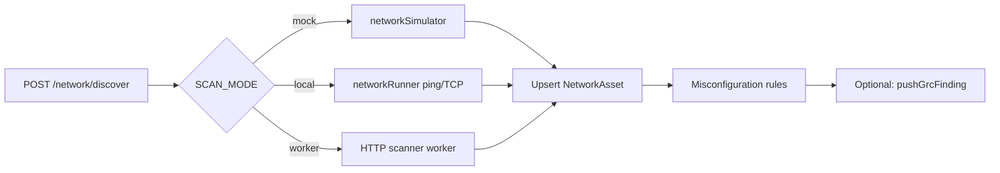
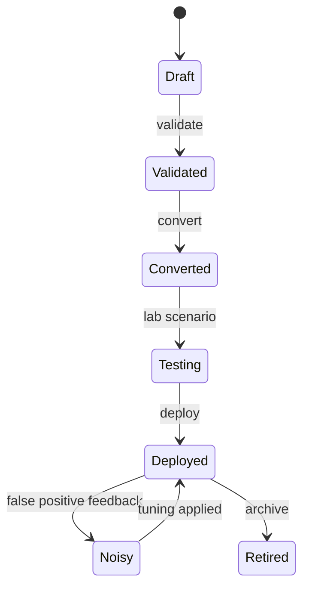
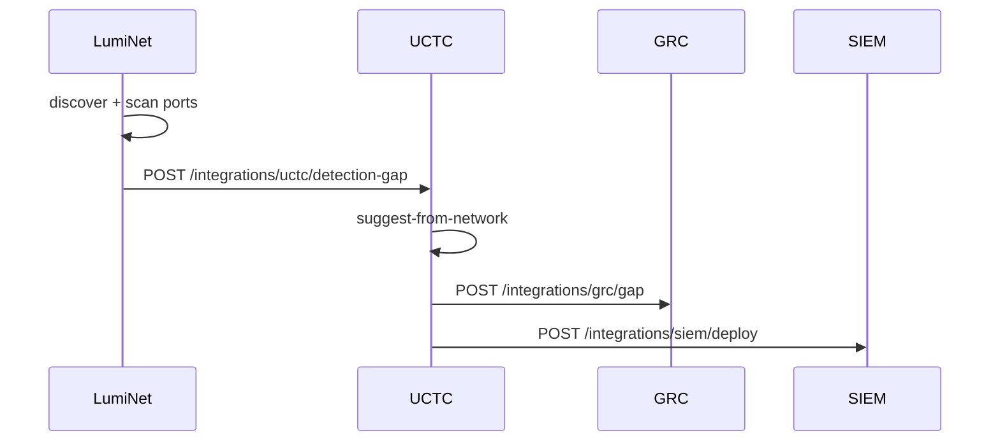

# Network (LumiNet) & UCTC Platform

Two complementary modules share detection-engineering and asset-context responsibilities:

- **LumiNet (Network)** — Asset discovery, port scanning, sniffing, misconfiguration detection
- **UCTC** — Sigma rule builder, sandbox lab, rule tuning, SIEM deployment

Both mount under versioned aliases for backward-compatible API documentation.

---

## Route Mounting

| Module | Primary Path | Versioned Alias |
|--------|--------------|-----------------|
| LumiNet | `/api/luminet` | `/api/v1/network/*`, `/api/v1/assets/*`, `/api/v1/sniffing/*` |
| UCTC | `/api/uctc` | `/api/v1/rules/*`, `/api/v1/lab/*`, `/api/v1/tuning/*` |

Configured in `src/bootstrap.js`.

---

# Part 1: LumiNet (Network Module)

Implementation: `src/modules/network/`

## Capabilities

- **Network discovery** — CIDR sweep with ping/TCP connect (configurable mode)
- **Port scanning** — Service detection on target hosts
- **Asset inventory** — MAC/IP indexed asset database
- **Asset context API** — IP lookup for SOAR/GRC/UCTC cross-referencing
- **Packet sniffing** — Session-based capture (mock or worker/cloud mode)
- **Misconfiguration detection** — Weak services (Telnet, FTP, etc.)
- **Flow metrics** — Traffic anomaly indicators
- **Outbound integrations** — GRC findings, SOAR incidents, UCTC gaps, SIEM, OpenCTI

## Route Map (14 endpoints)

### Core Operations (9)

| Method | Path | Auth Roles |
|--------|------|------------|
| POST | `/network/discover` | admin, detection_engineer, it_manager |
| POST | `/network/scan-ports` | admin, detection_engineer, it_manager |
| GET | `/assets/inventory` | + soc_analyst, soc_manager, grc_manager |
| GET | `/assets/details/:mac` | read roles |
| GET | `/assets/context/:ip` | read roles |
| POST | `/sniffing/start` | admin, detection_engineer, soc_analyst |
| GET | `/sniffing/live-stream` | sniffing roles |
| GET | `/network/misconfigurations` | read roles |
| GET | `/network/flow-metrics` | read roles |

### Integrations (5)

Accept JWT or `X-Internal-Api-Key: ***`.

| Method | Path | Target |
|--------|------|--------|
| POST | `/integrations/grc/finding` | GRC finding ingest |
| POST | `/integrations/soar/incident` | SOAR incident create |
| POST | `/integrations/uctc/detection-gap` | UCTC coverage gap |
| POST | `/integrations/siem/event` | ELK index |
| POST | `/integrations/opencti/enrichment` | OpenCTI IOC lookup |

## Execution Modes

Environment variables control scan and sniff behavior:

| Variable | Values | Description |
|----------|--------|-------------|
| `LUMINET_SCAN_MODE` | `mock`, `local`, `worker`, `cloud` | Discovery/scan backend |
| `LUMINET_SNIFFING_MODE` | `mock`, `worker`, `cloud` | Packet capture backend |
| `LUMINET_SCANNER_WORKER_URL` | URL | External scanner service (port 4100) |
| `LUMINET_SNIFFER_WORKER_URL` | URL | External Scapy/libpcap service (port 4200) |

Helpers: `src/utils/helpers/networkRunner.js`, `networkSimulator.js`, `networkDetectionContext.js`.

## Data Models

| Model | Purpose |
|-------|---------|
| `NetworkAsset` | Discovered host (IP, MAC, OS guess, services) |
| `NetworkScan` | Scan job metadata and results |
| `SniffingSession` | Active/completed sniff sessions |
| `NetworkMisconfiguration` | Detected weak configs |
| `NetworkFlowMetric` | Traffic flow statistics |

## Discovery Flow



---

# Part 2: UCTC Module

Implementation: `src/modules/uctc/`

Unified Cyber Threat & Compliance tooling for detection engineers: Sigma YAML authoring, multi-SIEM conversion, isolated script execution, rule tuning, and deployment tracking.

## Capabilities

- **Sigma rule CRUD** — Validate, convert, save, deploy, archive
- **Multi-SIEM conversion** — Elastic, Splunk, Sentinel query formats via `sigmaConverter.js`
- **Network-informed suggestions** — Rule ideas from LumiNet asset context
- **Sandbox lab** — Docker-isolated PowerShell/Python/Bash execution
- **Built-in scenarios** — Safe attack simulations (`uctcScenarios.js`)
- **Rule tuning** — Noisy rule detection, exclusion suggestions, alert feedback
- **SIEM deploy integration** — Push converted rules (mock until cloud credentials available)
- **Outbound integrations** — GRC gaps, SOAR incidents, network coverage, OpenCTI

## Route Map (26 endpoints)

### Rules (12)

| Method | Path | Notes |
|--------|------|-------|
| POST | `/rules/validate` | Validate YAML without save |
| POST | `/rules/convert` | Preview SIEM conversion |
| POST | `/rules` | Create saved rule |
| POST | `/rules/save` | PDF-documented alias |
| GET | `/rules` | List with filters |
| GET | `/rules/list` | PDF-documented alias |
| POST | `/rules/suggest-from-network` | LumiNet context suggestions |
| GET | `/rules/:ruleId` | Get by ID |
| POST | `/rules/:ruleId/convert` | Re-convert saved rule |
| PATCH | `/rules/:ruleId` | Update metadata/YAML |
| POST | `/rules/:ruleId/deploy` | Mark deployed / push to SIEM |
| PATCH | `/rules/:ruleId/archive` | Retire rule |

### Lab (4)

| Method | Path |
|--------|------|
| POST | `/lab/execute-script` |
| POST | `/lab/execute-scenario` |
| GET | `/lab/runs` |
| GET | `/scenarios/list` |

### Tuning (4)

| Method | Path |
|--------|------|
| GET | `/tuning/noisy-rules` |
| GET | `/tuning/suggestions` |
| POST | `/tuning/apply` |
| POST | `/tuning/alerts/ingest` |

### Dashboard (1)

| Method | Path |
|--------|------|
| GET | `/dashboard/stats` |

### Integrations (5)

| Method | Path |
|--------|------|
| POST | `/integrations/grc/gap` |
| POST | `/integrations/soar/incident` |
| POST | `/integrations/network/coverage` |
| POST | `/integrations/siem/deploy` |
| POST | `/integrations/opencti/ioc` |

## Sandbox Configuration

| Variable | Default | Purpose |
|----------|---------|---------|
| `UCTC_SANDBOX_MODE` | `mock` | `mock` or `docker` |
| `UCTC_SANDBOX_TIMEOUT_SEC` | 30 | Max execution time |
| `UCTC_SANDBOX_MEMORY` | 512m | Docker memory limit |
| `UCTC_SANDBOX_CPUS` | 1 | CPU limit |
| `SIEM_DEPLOYMENT_MODE` | `mock` | SIEM push mode |

Docker images (configurable):

```
UCTC_SANDBOX_POWERSHELL_IMAGE=mcr.microsoft.com/powershell:latest
UCTC_SANDBOX_PYTHON_IMAGE=python:3.12-alpine
UCTC_SANDBOX_BASH_IMAGE=bash:5.2
```

Implementation: `src/utils/helpers/sandboxRunner.js`

## Rule Status Lifecycle



Statuses defined in `ruleStatus` enum: `draft`, `validated`, `converted`, `testing`, `deployed`, `noisy`, `stale`, `retired`.

## Data Models

| Model | Purpose |
|-------|---------|
| `SigmaRule` | Saved Sigma YAML and conversions |
| `SandboxRun` | Lab execution audit log |
| `UctcTuning` | Exclusion queries and tuning metadata |

## Cross-Module: Network ↔ UCTC



## Permissions

UCTC uses role arrays in the router:

- **Read rules**: admin, detection_engineer, soc_analyst, soc_manager
- **Write rules**: admin, detection_engineer
- **Approve/deploy**: admin, soc_manager
- **Lab execution**: admin, detection_engineer, red_team, soc_analyst
- **Integrations**: admin, soc_manager, detection_engineer, integration_admin

## Testing

`test/uctc.api.test.js` — **7 test cases** for rules, lab, and validation.

Network integration paths covered in `test/integrations.api.test.js`.
